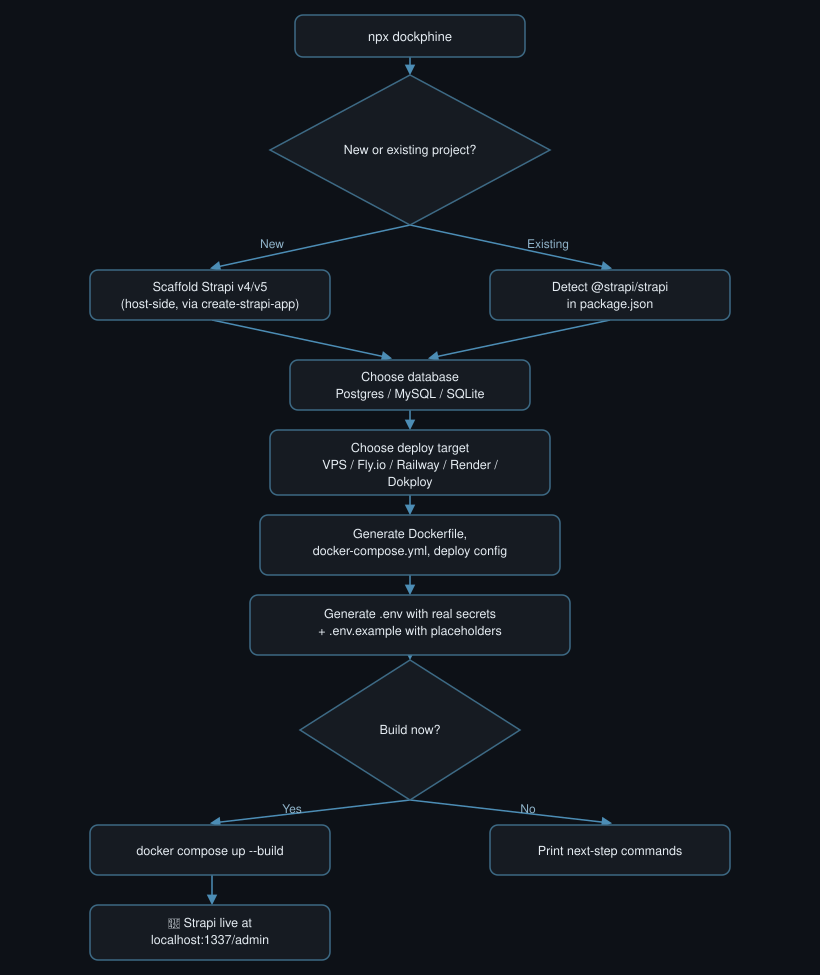

<div align="center">

# 🐬 D O C K P H I N E &nbsp; S T R A P I

### Dockerize Strapi. Production-ready. Under 2 minutes.

**The fastest way to go from zero to a production-ready, Dockerized [Strapi](https://strapi.io) project.**
<br />
One command. Real secrets generated for you. Deploy-ready config for the platform of your choice.
<br />
Open source, MIT-licensed, built for developers who ship.

[](https://github.com/dockphine/dockphine/releases)
[](https://www.npmjs.com/package/create-dockphine-strapi)
[](https://www.npmjs.com/package/create-dockphine-strapi)
[](LICENSE)
[](package.json)
[](CONTRIBUTING.md)
[](https://www.docker.com/)
[](https://www.typescriptlang.org/)
[](https://github.com/dockphine/dockphine)

```bash
npx create-dockphine-strapi
```

</div>

<br />

<div align="center">
  
  <br />
  <sub>Full run: prompts → scaffold → Docker build → live admin panel. See <a href="docs/README.md">docs/README.md</a> to regenerate this GIF.</sub>
</div>

<br />

## Table of contents

- [Why Dockphine](#why-dockphine)
- [Quick start](#quick-start)
- [How it works](#how-it-works)
- [Dual-mode scaffolding](#dual-mode-scaffolding)
- [Databases](#databases)
- [Deploy targets](#deploy-targets)
- [Secrets, handled correctly](#secrets-handled-correctly)
- [AI-agent aware](#ai-agent-aware)
- [Dockphine vs. doing it by hand](#dockphine-vs-doing-it-by-hand)
- [Supported matrix](#supported-matrix)
- [FAQ](#faq)
- [Contributing](#contributing)
- [License](#license)

<br />

## Why Dockphine

Dockerizing a **Strapi** headless CMS by hand means hand-writing a multi-stage `Dockerfile`,
wiring up `docker-compose.yml` for Postgres/MySQL/SQLite, generating six different secrets
correctly, and figuring out deploy config for whatever platform you're shipping to. Dockphine
does all of it in one interactive run.

- ⚡ **Fast by design** — scaffolds on the host, defers `npm install` to the Docker build layer,
  skips anything that isn't needed. A new project is running in Docker in under 2 minutes.
- 🐳 **Production-ready output, not a toy Dockerfile** — real multi-stage builds, slim runtime
  images, dev dependencies pruned, native modules (`sharp`, `better-sqlite3`) compiled correctly.
- 🔐 **Real secrets, generated for you** — `APP_KEYS`, `JWT_SECRET`, `ADMIN_JWT_SECRET`,
  `API_TOKEN_SALT`, `TRANSFER_TOKEN_SALT`, `ENCRYPTION_KEY`, and database credentials are
  cryptographically random from the first run. Zero manual `.env` editing to boot.
  A safe `.env.example` is generated alongside it for your repo — real values never touch git.
- 🌍 **Deploy anywhere** — generates config for a **generic VPS** (DigitalOcean, Hetzner, AWS,
  Contabo, or any box you SSH into), **Fly.io**, **Railway**, **Render**, or **Dokploy**.
  Config-only: nothing is provisioned or deployed without you running the command yourself.
- 🔁 **Works on existing projects too** — already have a Strapi app? Dockphine detects it and
  wraps it with Docker without touching your code or regenerating live secrets.
- 🤖 **AI-agent aware** — optionally generates a project-context file for Claude Code, Cursor,
  GitHub Copilot, Windsurf, Codex, or Gemini CLI, so your AI pair-programmer understands the
  Docker setup, the deploy target, and where secrets live before you even ask it to.
- 📦 **Strapi v4 and v5** — both supported, including automatically falling back to a
  containerized scaffold step when your local Node.js version doesn't satisfy Strapi's own
  engine requirements.
- 🧑‍💻 **Fully interactive, genuinely pleasant CLI** — built on `inquirer`, `chalk`, `ora`, and
  `cli-progress`, not a wall of flags to memorize.
- 🆓 **Open source, MIT-licensed** — free forever, [contributions welcome](#contributing).

<br />

## Quick start

```bash
npx create-dockphine-strapi
```

or, using npm's `create` shorthand:

```bash
npm create dockphine-strapi
```

Answer the prompts — mode, project name, Strapi version, database, port, deploy target, and
whether to build now — then:

```bash
cd your-project
docker compose up --build
```

Strapi admin panel: **http://localhost:1337/admin**

**Requirements:** Node.js ≥ 18.17 to run the CLI itself, and [Docker](https://docs.docker.com/get-docker/)
with the Compose plugin to run what it generates.

<br />

## How it works

<div align="center">
  
</div>

<br />

## Dual-mode scaffolding

**New Project** — Dockphine runs Strapi's own scaffolder (`create-strapi-app`) on the host,
pinned to the version you choose, before any Docker files exist. That means the generated files
are real, inspectable Strapi source from the first second — nothing happens inside a black-box
container build.

**Existing Project** — already have a Strapi app? Point Dockphine at it. It reads your
`package.json`, detects the Strapi major version, and generates Docker files around your
existing code. If you already have a `.env`, your real secrets are preserved — Dockphine only
fills in what's missing and wires up the database connection to match the new `docker-compose.yml`.

<br />

## Databases

| Engine | What you get |
|---|---|
| **PostgreSQL** | `postgres:16-alpine` service, healthchecked, credentials auto-generated |
| **MySQL** | `mysql:8` service, healthchecked, separate root and app passwords |
| **SQLite** | Zero extra containers — a persisted volume for the `.tmp` data file |

Every driver (`pg`, `mysql2`, `better-sqlite3`) is installed in the Docker build stage
regardless of which one you pick, so switching engines later is a `.env` change, not a rebuild
from scratch.

<br />

## Deploy targets

Dockphine generates **deploy-ready configuration**, never touches your cloud accounts, and
never provisions infrastructure on its own — you stay in control of every `docker compose up`
and every `fly deploy`.

| Target | What's generated |
|---|---|
| **Generic VPS** (DigitalOcean, Hetzner, AWS, Contabo, or any SSH box) | `docker-compose.vps.yml` overlay, a `Caddyfile` for automatic HTTPS, and a `deploy.sh` script |
| **Fly.io** | `fly.toml` |
| **Railway** | `railway.json` |
| **Render** | `render.yaml`, including a managed Postgres block when applicable |
| **Dokploy** | `docker-compose.dokploy.yml` with Traefik/Dokploy routing labels |

<br />

## Secrets, handled correctly

Strapi needs six secrets to boot (`APP_KEYS`, `JWT_SECRET`, `ADMIN_JWT_SECRET`,
`API_TOKEN_SALT`, `TRANSFER_TOKEN_SALT`, `ENCRYPTION_KEY`) plus database credentials. Getting
any of these wrong — or forgetting to set them — is the single most common reason a
freshly-Dockerized Strapi app fails to start.

Dockphine generates two files:

- **`.env`** — real, cryptographically random values. Gitignored. Your project boots
  immediately, with zero manual editing.
- **`.env.example`** — committed to your repo, with independently-generated fake-but
  correctly-shaped values and a comment telling anyone who clones the repo exactly what to
  replace. Never a copy of your real secrets.

<br />

## AI-agent aware

If you use an AI coding assistant, Dockphine can generate a project-context file in that
assistant's native format — so it already knows your Strapi version, database choice, Docker
layout, where secrets live (and that it shouldn't regenerate them), and your deploy target's
exact next-step command.

| Agent | File generated |
|---|---|
| Claude Code | `CLAUDE.md` |
| Cursor | `.cursor/rules/dockphine.mdc` |
| GitHub Copilot | `.github/copilot-instructions.md` |
| Windsurf | `.windsurfrules` |
| Codex | `AGENTS.md` |
| Gemini CLI | `GEMINI.md` |
| Anything else | `AGENTS.md` (generic) |

<br />

## Dockphine vs. doing it by hand

| | By hand | `create-dockphine-strapi` |
|---|---|---|
| Multi-stage `Dockerfile` | Write and debug it yourself | Generated, production-shaped |
| Database service + healthchecks | Copy-paste from a blog post, hope it's current | Generated per engine, healthchecked |
| Strapi secrets | Generate 6 values manually, easy to get wrong | Cryptographically random, correct, automatic |
| `.env` vs `.env.example` hygiene | Often skipped entirely | Both generated, real vs. placeholder, by default |
| Deploy config (VPS / Fly / Railway / Render / Dokploy) | Research each platform from scratch | Generated on request, config-only |
| AI agent context | Write it yourself, if you remember to | Generated, agent-native format |
| Time to a running container | 30–60+ minutes | **Under 2 minutes** |

<br />

## Supported matrix

- **Strapi**: v4, v5
- **Database**: PostgreSQL, MySQL, SQLite
- **Deploy target**: Generic VPS (DigitalOcean / Hetzner / AWS / Contabo / self-hosted), Fly.io,
  Railway, Render, Dokploy
- **AI agent**: Claude Code, Cursor, GitHub Copilot, Windsurf, Codex, Gemini CLI, generic

<br />

## FAQ

**How do I Dockerize an existing Strapi project?**
Run `npx create-dockphine-strapi` from inside your existing project's root directory and choose
"Dockerize an existing Strapi project" — it detects `@strapi/strapi` in your `package.json`
automatically.

**Does this deploy my app for me?**
No. Every deploy target generates config-only output — `docker-compose.yml`, `fly.toml`,
`railway.json`, `render.yaml`, or a `deploy.sh` script. You run the actual deploy command
yourself, on your own schedule, with your own credentials.

**What's the fastest way to run Strapi in Docker?**
`npx create-dockphine-strapi`, answer the prompts, then `docker compose up --build`. That's the
whole workflow — see [Quick start](#quick-start).

**Does it work with Strapi v4 or only v5?**
Both. If your local Node.js version doesn't satisfy the Strapi major version you pick, Dockphine
automatically scaffolds inside a temporary, correctly-versioned Docker container instead of
failing.

**Is my data safe? Does Dockphine ever see my secrets?**
Everything runs locally. Secrets are generated with Node's `crypto` module on your machine and
written straight to your local `.env`. Nothing is sent anywhere.

<br />

## Contributing

Dockphine is open source and contributions are genuinely welcome — bug reports, new deploy
target adapters, additional AI agent formats, docs fixes, all of it.

1. Fork the repo and create a branch off `main`
2. `npm install && npm run build` to build the CLI, `npm link` to test it locally
3. Open a PR — see [CONTRIBUTING.md](CONTRIBUTING.md) for the full guide

If you find Dockphine useful, a ⭐ on the repo goes a long way.

<div align="center">
  
</div>

<br />

## License

[MIT](LICENSE) © [dockphine](https://github.com/dockphine)

<div align="center">
<sub>Built for developers who'd rather ship than write Dockerfiles by hand. 🐬</sub>
</div>
